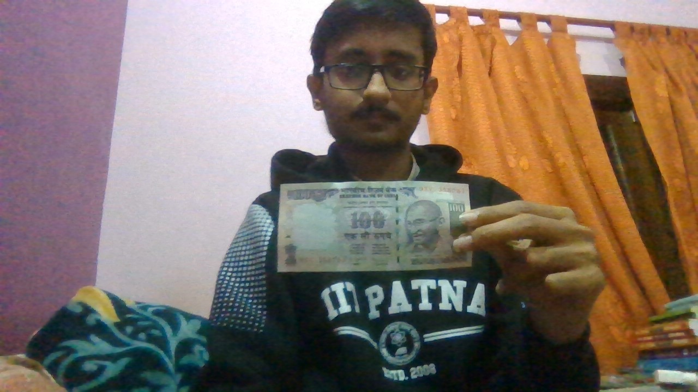
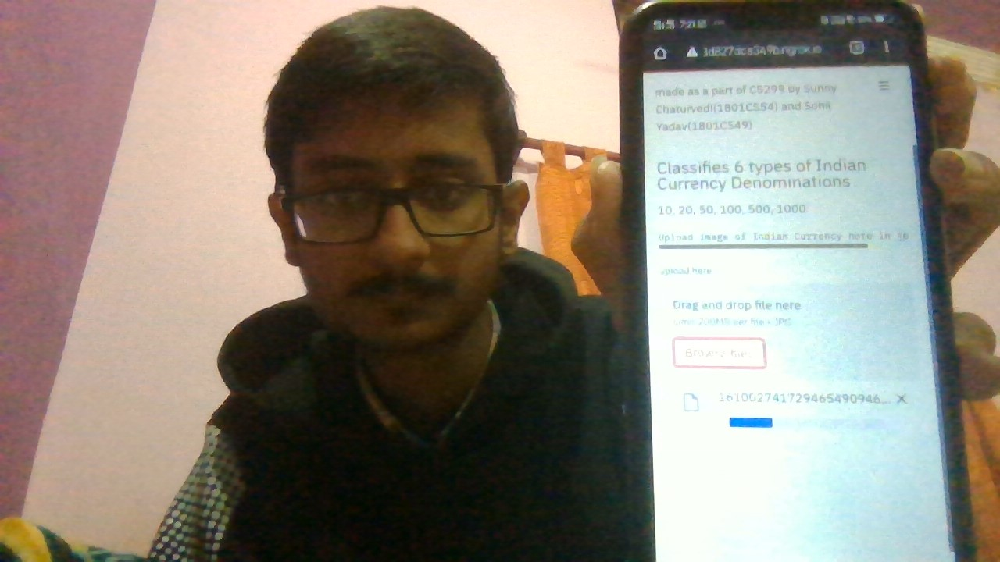

# InnovationLabProject-CS299
Denomination Detector for visually impaired. </p>
dataset link - https://drive.google.com/file/d/0B7Am6-nOVeP7N1lQOUVUYlBuc0E/edit </p>
ppt link - https://docs.google.com/presentation/d/1p9zzDof2HG6Ztqtw7jA9SDmfZYiU4MzaE7J9OCUfLTs/edit?usp=sharing </p>


## Description
A technological solution to help visually impaired persons identify denomination of given Indian Currency Note.
Built using Transfer Learning using MobileNetV2[1] from keras , presented with a simple webapp interface using Streamlit and deployed for testing on Pyngrok.


## References
<a id="1">[1]</a> 
MobileNets: Efficient Convolutional Neural Networks for Mobile Vision Applications
Andrew G. Howard, Menglong Zhu, Bo Chen, Dmitry Kalenichenko, Weijun Wang, Tobias Weyand, Marco Andreetto, Hartwig Adam

### Notes -
The webapp was deployed temporarily on ngrok from google colab.
note - the deployment was only for a temporary time as we couldnt afford the paid service of hosting.(the webapp deployment notebook runned in google colab is attached)


To run locally -
1. first put all files in a folder

2. run commands (in python)

```sh
pip install requirements.txt
streamlit run app.py
```

It will open the app locally

The images were taken when the app was deployed for 24hour period.


100Rs Note

Uploading the photo of note taken from camera.

The App predicts the denomination of given currency note.


